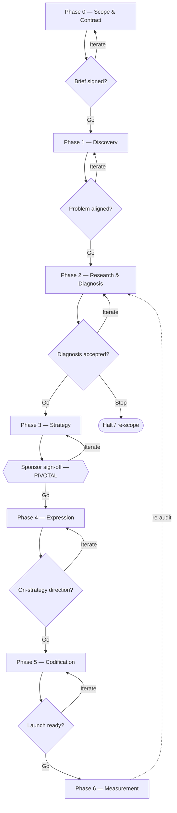
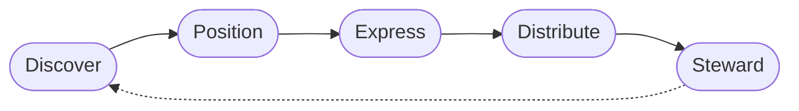

# Brand, From Products to Source Code
### A Framework, a Method, and Field Studies

---

## Preface — how to read this book

This book makes one argument in three moves: **define the thing, build a method
to study it, then use the method in the open.**

The word *brand* is used constantly and examined rarely. Chapter 1 starts by
refusing the usual shorthand and building the concept from its literal root up;
it then turns that concept into a working method — how a marketing agency
actually runs a brand study, from engagement to deliverables to the decisions in
between. Chapter 2 puts the method to work on four real subjects and lets the
results, flattering or not, stand.

A through-line connects every case: the **trust-and-ownership axis**. On one end
sit products that monetize attention or data; on the other, products that win by
giving people control. Claude positions on staying ad-free; Meta's business runs
on advertising; Obsidian and Ollama win on "your files, your hardware, yours."
Watching where each subject sits on that axis — and what it costs them to stay
there — is the recurring lesson.

Two habits run throughout. First, **every claim is tagged** for how much weight
it can bear (see the evidence-tag legend in the front matter). Second, **feedback
and received wisdom are processed, not obeyed**: where a common framing is wrong
or overstated, it is corrected rather than repeated. The aim is calibration —
neither flattery nor reflexive skepticism.

### Table of contents

**Chapter 1 — Foundations: what a brand is and how to study one**
- 1.1 What a brand is: the five-layer stack
- 1.2 The domain-general loop
- 1.3 Building a business brand
- 1.4 Macro and micro: people and nations
- 1.5 Technical branding: source code and foundations
- 1.6 The brand-study method (the playbook)

**Chapter 2 — Field studies: the method applied**
- 2.1 Claude (Anthropic)
- 2.2 Meta: the rebrand that changed the sign, not the reputation
- 2.3 Obsidian — live audit
- 2.4 Ollama — live audit
- 2.5 Cross-case synthesis: the trust-and-ownership axis
- 2.6 What primary research would add

**Back matter**
- Appendix A — Figures
- Sources & Provenance
- Epistemic flags (unverified / synthesized / research-required)

---

# Chapter 1 — Foundations: what a brand is and how to study one

## 1.1 What a brand is: the five-layer stack

"Brand" is not one idea but a stack of them, accumulated over roughly four
millennia, running from a literal mark to a feeling in someone's head. Treating
any single layer as *the* definition — as the practitioner shorthand "gut
feeling" does — collapses the stack. Each layer below is SOURCED; the ordering
is SYNTHESIS, and the historical and analytical sequences happen to align.

- **Layer 1 — A mark (ownership and origin).** The word is literally a burn:
  from Old Norse *brandr*, "to burn." The sense of a mark seared with a hot iron
  — onto livestock, then casks and goods to identify maker and quality — is
  recorded from the 1550s; "a particular make of goods" only by 1854 [SOURCED:
  Etymonline]. The practice is older still: branded livestock appears in Egyptian
  imagery around 2,700 BCE [SOURCED, tertiary]. *Whose is this, and who made it?*
- **Layer 2 — A distinguishing sign (the trademark).** Once a mark identifies a
  maker, it separates that maker's goods from everyone else's. The American
  Marketing Association defines a brand as an identifying name, term, design, or
  symbol that marks one seller's good as distinct from others'; the legal term is
  *trademark* [SOURCED: AMA]. *Which of these competing options is which?*
- **Layer 3 — A quality signal (reputation under uncertainty).** A buyer who
  cannot inspect quality leans on the mark as a proxy. Formally, Erdem and Swait
  treat brand equity as the value of a brand as a *credible signal* that raises
  perceived quality and lowers perceived risk and information costs [SOURCED:
  Erdem & Swait 1998]. This is where a brand becomes an economic asset and a
  barrier to entry, because reputation is costly to build and hard to copy.
  *Can I trust this without checking?*
- **Layer 4 — A structure in memory (associations).** The signal works because
  it is stored. Keller models a brand as *brand knowledge*: an associative
  memory network of awareness (can you recall it) plus image (the associations
  attached to it) [SOURCED: Keller 1993]. *What comes to mind, and how strongly?*
- **Layer 5 — A felt impression (the practitioner shorthand).** The affective
  summary of the layers beneath is Neumeier's "a person's gut feeling about a
  product, service, or organization" [SOURCED: Neumeier 2003]. Useful precisely
  because it locates the brand in the audience's perception — but it is a
  *summary of* the stack, not a substitute for it.

Each later part of this book manages a different layer for a different entity: a
trademark dispute lives at Layer 2; a "Made in [Country]" premium is a Layer 3
signal; a personal brand is Layers 4–5 attached to a person.

## 1.2 The domain-general loop

Strip the corporate vocabulary off "building a brand" and the same loop appears
for any entity. It is a SYNTHESIS — a generalization, not a cited universal — but
it has a recognized neighbor in Keller's brand-resonance pyramid (salience →
meaning → response → resonance), which climbs the same ladder as the stack above.

| Phase | Company | Person | Nation | Software project |
|---|---|---|---|---|
| Define / discover core | Purpose, vision, values | Strengths, niche, values | Audit of what the country *does* | Mission, design philosophy |
| Position | vs. competitors | vs. peers | vs. other states | vs. rival tools / which audience |
| Express | Name, identity, voice | Presentation, portfolio, voice | Symbols, narrative, exports | Name, API, docs, voice |
| Distribute consistently | Digital/physical/content | Talks, writing, conduct | Tourism, exports, diplomacy | Docs, releases, community |
| Steward | Audits, guidelines, refresh | Reputation management | NBI tracking, policy | Governance, versioning |

The **irreducible subset** beneath all of it: a persistent distinguishing
identifier (Layer 2) plus consistency over time — repetition is the only
mechanism that turns a sign into a reputation. Everything else is optional
scaffolding that scales with resources. The single variable that explains why the
same loop looks so different across columns is the **ratio of projected to earned
reputation** — high control for a company, lowest for a nation, which is why a
government cannot simply project a national image (see 1.4).

## 1.3 Building a business brand

The corporate process is a five-step SYNTHESIS — common agency practice, not a
single author's sequence. Jumping to visual design before settling strategy tends
to produce a forgettable result.

1. **Define brand strategy** — purpose, vision, values. The internal,
   aspirational construct is Aaker's *brand identity* [SOURCED: Aaker 1995/1996].
2. **Research audience and competitors → position** — occupy a distinct place in
   the prospect's mind [SOURCED: Ries & Trout 1981].
3. **Develop identity** — name, visual system, voice.
4. **Build touchpoints** — digital, physical, content surfaces.
5. **Manage and evolve** — guidelines, audits, refresh. A brand is a maintained
   activity, not a finished artifact [SOURCED: Neumeier 2003].

## 1.4 Macro and micro: people and nations

Because a brand is a reputation construct (Layers 3–4), any entity with a
reputation can be branded.

**Personal branding.** A personal brand is Layers 4–5 attached to a person —
roughly what people say when you leave the room — managed or not. Tom Peters
*popularized* the idea in 1997's "The Brand Called You" ("Me Inc.") [SOURCED:
Peters 1997]; "popularized," not strictly "coined," is the defensible claim.

**Nation branding — sourced but contested.** Simon Anholt coined "nation brand"
in 1996 and founded the index now called the Anholt-Ipsos Nation Brands Index
[SOURCED: Anholt 2009/2010]. But Anholt himself rejects the marketing reading:
national reputation is earned through conduct and policy, not projected through
PR — his "Competitive Identity." Treat the associations below as ILLUSTRATIVE,
not measured equity.

| Country | Common association [ILLUSTRATIVE] | Note |
|---|---|---|
| Switzerland | Precision, neutrality | Premium in watches, finance, medtech |
| Germany | Engineering, reliability | Led the Anholt-Ipsos index for six years until Japan took first in 2023 [SOURCED] |
| France | Heritage luxury, gastronomy | Strong in couture, cosmetics, tourism |
| Costa Rica | Eco-sustainability, *Pura Vida* | A stated positioning, not a ranking |

South Korea's multi-decade *Hallyu* repositioning — state-supported exports of
electronics, K-pop, and cinema — is the most documented deliberate national
rebrand [SOURCED: Hong 2014; Nye 2004 for the soft-power mechanism].

## 1.5 Technical branding: source code and foundations

In software, reputation governs adoption as it does for consumer goods; the
audience shifts to developers and enterprise buyers. A project's standing is a
Layer-3 signal (will this be maintained, will it break my stack?) held in place
by Layer-4 associations.

Key touchpoints: **developer experience** (documentation clarity, time-to-first-
success — the subject of Bacon's *The Art of Community* [SOURCED: Bacon 2009]);
**community culture** (adoption tracks community health; Rust is a common
ILLUSTRATIVE example); and **project philosophy**. The argument that modern open
source is reputation- and maintainer-driven is Eghbal's *Working in Public*
[SOURCED: Eghbal 2020, published by Stripe Press — not "funded by Stripe"; the
Ford Foundation funded her earlier *Roads and Bridges*].

If a codebase is the product, a **foundation** is the neutral steward, selling
trust, governance, and vendor neutrality: the Apache Software Foundation
("Community Over Code"), the Linux Foundation (host of Kubernetes via the CNCF),
the Mozilla Foundation (Firefox, MDN). [SOURCED + ILLUSTRATIVE for the one-line
brand summaries.]

## 1.6 The brand-study method (the playbook)

A **brand study** runs the loop of 1.2 once, intensively, as a paid engagement,
and hands the client the means to keep running it. Diagnosis works *down* the
stack (what does the felt impression rest on?); strategy and expression build
back *up* it.

### 1.6.1 Engagement and decision rights

The most common failure is governance, not analysis. Two roles must be separated
from day one: **the agency recommends; a named client sponsor decides.** A RACI
assignment (Responsible / Accountable / Consulted / Informed — a standard
project convention) fixes one accountable decision-maker per artifact, which is
what prevents design-by-committee.

### 1.6.2 The gated phases

Each phase ends in a sponsor-owned *go / iterate / stop* gate; the structure is a
SYNTHESIS of convergent agency practice.

- **Phase 0 — Scope & contract.** Objectives, KPIs, scope, budget. *Gate:* signed
  brief.
- **Phase 1 — Discovery (internal).** Stakeholder interviews; asset review;
  internal audit across internal branding, external branding, and customer
  experience [SOURCED: agency methodologies]. *Gate:* problem alignment.
- **Phase 2 — Research & diagnosis (external).** Qualitative (interviews, focus
  groups) and quantitative (surveys, brand tracking); competitive audit; brand-
  health/equity measurement. Deliverable: a **Brand Audit Report** with a gap
  analysis (intended vs. perceived), SWOT, and prioritized findings (exec summary
  + ~10–20pp report + data pack) [SOURCED]. *Gate:* diagnosis accepted (go/no-go).
  Caution: an established brand that rebrands risks ~15–20% temporary customer
  confusion [SOURCED, agency-sourced — verify].
- **Phase 3 — Strategy.** Positioning, captured in Moore's template — *for*
  [target] *who* [need], [brand] *is a* [category] *that* [benefit]; *unlike*
  [alternative], it [differentiation] [SOURCED: Moore]. Brand platform (Kapferer's
  six-facet prism a common scaffold). *Gate:* **sponsor sign-off — the pivotal
  decision.**
- **Phase 4 — Expression.** Verbal and visual identity; validate with the target
  audience, not internal taste. *Gate:* select a direction *on-strategy*.
- **Phase 5 — Codification & activation.** Brand book, rollout, governance.
  *Gate:* launch readiness.
- **Phase 6 — Measurement & evolution.** Tracking against Phase-0 KPIs; periodic
  re-audit. *Gate:* a standing review rhythm.

### 1.6.3 The decision process

Three rules. (a) Gate decisions are explicit, owned, and recorded. (b) Subjective
choices are judged *on-strategy* first — "does this express the signed
positioning?" — with validation data, not seniority, breaking ties. (c) A
positioning is ready when the target is specific, the "unlike" names a real
alternative, the benefit is an outcome, and the claim is provable.

### 1.6.4 Deliverables map

| Phase | Deliverable | Decision it informs |
|---|---|---|
| 0 | Signed brief | Whether/how to proceed |
| 1 | Discovery readout | Problem alignment |
| 2 | Brand Audit Report (+gap, SWOT) | Go/no-go on direction |
| 3 | Brand Platform + Positioning | Strategic commitment |
| 4 | Identity concepts + validation | Choice of direction |
| 5 | Brand Book + rollout | Launch readiness |
| 6 | Tracking dashboard | Ongoing evolution |

### 1.6.5 Methods and models (the evidence base)

*Research:* qualitative (the "why"; not projectable), quantitative (sizes
awareness/preference; measures perception, not truth), NPS (one loyalty signal),
social listening (skewed to the vocal). *Equity & identity models:* Keller CBBE /
resonance pyramid (where equity is weak); Aaker (internal identity, equity
components); Young & Rubicam's **BrandAsset Valuator** — Differentiation +
Relevance (strength/vitality, leading) and Esteem + Knowledge (stature, lagging),
on a Power Grid; Kapferer's prism (six identity facets); Ries & Trout
(positioning); Moore (the positioning-statement template). None substitutes for
judgment. [All SOURCED.]

---

# Chapter 2 — Field studies: the method applied

*These four studies apply Chapter 1's method to real subjects. They are desk
research as of June 2026; no primary perception research was run, so awareness
and preference claims are RESEARCH-REQUIRED (see 2.6). The Claude study carries a
conflict of interest noted in the front matter and is written to state risks as
plainly as strengths. References for every sourced claim are consolidated in
Sources & Provenance.*

## 2.1 Claude (Anthropic)

**Snapshot.** Claude is the AI-assistant family from Anthropic, a Public Benefit
Corporation whose stated purpose is "the responsible development and maintenance
of advanced AI for the long-term benefit of humanity" [SOURCED]. A Long-Term
Benefit Trust holds special voting rights intended to protect the mission from
investor pressure — structural backing for the safety claim, not just messaging.

**Through the stack.** *Mark:* "Claude," a human first name (an homage to Claude
Shannon). *Sign:* the poetry-form model tiers — Haiku, Sonnet, Opus, with a higher
Mythos tier — which name by craft where rivals name by spec. *Signal:* trust under
uncertainty (caution, reliability). *Associations:* AI safety, Constitutional AI,
enterprise trust, strong coding — and, as a double edge, caution some read as
over-refusal. *Felt impression:* a calm "space to think," contrasted with
attention-monetizing products. [SOURCED + SYNTHESIS]

**Reconstructed positioning [SYNTHESIS].** *For* people and organizations who need
a capable AI assistant they can trust with consequential work, *Claude is* an
assistant that pairs frontier capability with safety-first design; *unlike*
ad-supported, engagement-optimized assistants, it is built by a public-benefit
company that keeps the product ad-free and declines uses it judges harmful. The
"unlike" is real: Anthropic has said Claude will stay ad-free as OpenAI introduced
ads to free ChatGPT, and dramatized the contrast in a 2026 Super Bowl campaign
[SOURCED].

**Diagnosis.** *Strengths:* a differentiated safety identity with structural
backing; authenticity from costly signals (it refused U.S. Department of Defense
demands to drop restrictions on surveillance and autonomous weapons, and was
labeled a "supply chain risk" for it); strong developer/enterprise standing
[SOURCED]. *Risks (plainly):* a consumer-mindshare gap behind ChatGPT; the
"caution paradox" where safety reads as restrictive; brand-safety tensions (a
reported state-sponsored misuse incident; a US$1.5B copyright settlement) sitting
awkwardly beside a safety brand; IPO/valuation pressure straining "safety over
speed"; and erosion as every rival now claims "safety," so the edge depends on
making safety *provable*, not asserted [SOURCED + SYNTHESIS]. *Gap hypothesis
[RESEARCH-REQUIRED]:* intended "frontier-capable, genuinely helpful, trustworthy"
vs. a plausible perceived "capable but cautious/corporate."

## 2.2 Meta: the rebrand that changed the sign, not the reputation

**Background.** Facebook (2004) grew into a family of apps, then hit sustained
reputation strain — Cambridge Analytica, misinformation, and in autumn 2021 the
Frances Haugen disclosures [SOURCED].

**The rebrand.** On October 28, 2021, the *parent company only* was renamed Meta,
to signal a metaverse pivot ("metaverse-first, not Facebook-first"); the apps kept
their names; reporting split into Family of Apps and Reality Labs; the ticker
ultimately became META in mid-2022 [SOURCED].

**Through the lenses.** The rename changed the *sign* (Layer 2) but not the
*reputation* (Layers 3–4): the Facebook app kept its name and its controversies. A
survey found 51% of U.S. adults saw the move as distancing from bad press; Meta
denied it [SOURCED, the survey ILLUSTRATIVE]. The branding lesson is 1.4's
earned-not-projected point: a rename cannot repair conduct-based reputation. The
architecture logic (a parent brand over a family of apps) was sound — but the
comparison to Alphabet exposes the mistake: Alphabet is a deliberately empty name
that fits any future, while **Meta hard-coded one bet — the metaverse — into the
corporate identity.**

**What happened next.** Reality Labs lost roughly $6.6B (2020), $10.2B, $13.7B,
$16.1B, $17.7B, and $19.2B (2025) — about **$83.6B cumulative** against negligible
revenue [SOURCED]. After a 2022 collapse and a 2023 "Year of Efficiency" (~21,000
jobs cut, strong stock recovery), the real future turned out to be AI: open Llama
models, then — after Llama 4 disappointed — a $14.3B Scale AI deal, Meta
Superintelligence Labs, a retreat from full open-source, the proprietary Muse Spark
model (April 2026), and 2026 AI capex guided to $115–135B [SOURCED]. A company named
for the metaverse is now an AI-and-advertising company.

**Assessment by criterion [SYNTHESIS].**

| Criterion | Verdict |
|---|---|
| Corporate-brand separation | Achieved |
| Signaling the future | Failed (bet on the wrong future) |
| Reputation repair | Not achieved (and contested as a goal) |
| Business outcome | Strong (recovery, ~$200B+ 2025 revenue) |

The instructive tension: **the company succeeded while the rebrand's central
premise did not.** Score the business and the brand separately.

## 2.3 Obsidian — live audit

**Snapshot.** A local-first, Markdown PKM app: notes are plain `.md` files on your
device, no account, no cloud dependency [SOURCED]. Created by Shida Li and Erica Xu
(the Dynalist creators; Steph Ango joined as CEO in 2023). The company (Dynalist
Inc.) is **bootstrapped, 100% user-supported, zero VC, deliberately tiny**
[SOURCED; reported ~1.5M users / ~$25M ARR are secondary estimates —
RESEARCH-REQUIRED].

**Positioning [SYNTHESIS].** *For* individuals who want a fast, private knowledge
base they fully own, *Obsidian is* a local-first Markdown app that keeps everything
as plain files; *unlike* cloud note tools, it needs no account, locks in no data,
and is funded by users rather than ads or investors.

**Competitive.** Notion (cloud team OS, ~100M users, VC-backed) is the mainstream
opposite; Logseq is the closest *open-source* philosophical match; the live 2026
threat is "AI second brain" tools reframing the category. [SOURCED]

**Diagnosis.** *Strengths:* independence as brand infrastructure — a user-funded,
no-ads, no-investor structure that *proves* the data-respect claim the way the
Anthropic PBC backs a safety claim; a deep plugin ecosystem and intensely engaged
community ("the product is the marketing"); plain-text permanence [SOURCED +
SYNTHESIS]. *Risks:* single-player by design (weak collaboration); a power-user
reputation; proprietary, not open-source (Logseq's opening); small-team limits; the
AI-era category shift [SOURCED + SYNTHESIS]. *Gap hypothesis [RESEARCH-REQUIRED]:*
intended "fast, private, permanent, extensible" vs. perceived "intimidating /
teams-weak."

## 2.4 Ollama — live audit

**Snapshot.** An open-source (MIT) runtime that runs LLMs locally in one command
(`ollama run llama3`), with a Dockerfile-like Modelfile and an OpenAI-compatible
API; widely the **de facto standard** (100M+ downloads, 110k+ GitHub stars
reported by April 2026) [SOURCED]. Founded 2023 by Jeffrey Morgan and Michael
Chiang; small, lightly funded team [SOURCED; HQ reported inconsistently —
RESEARCH-REQUIRED].

**Positioning [SYNTHESIS].** *For* developers who want to run AI models on their
own hardware, *Ollama is* a local runtime that makes models as easy to pull and run
as containers; *unlike* cloud APIs, it keeps data on your machine, costs nothing
per token, and works offline.

**Competitive.** LM Studio (proprietary GUI) wins on no-terminal UX; llama.cpp is
the open upstream Ollama builds on; Jan out-opens it on auditability; cloud APIs are
the macro alternative. [SOURCED]

**Diagnosis.** *Strengths:* category leadership and ecosystem gravity (tools default
to it as a backend); a superb ownable metaphor ("Docker for LLMs"); textbook
developer experience; authentic alignment with data-sovereignty [SOURCED]. *Risks:*
a **namesake dependency** — "Ollama" rides on "Llama," whose owner Meta is moving to
closed models (see 2.2), a namesake drifting from Ollama's open ethos; thin
technical differentiation (shared llama.cpp); an upstream-attribution question; and
the central tension of commercializing via **Ollama Cloud** without appearing to
drift from the local-first, no-account brand that won the audience [SOURCED +
SYNTHESIS]. *Gap hypothesis [RESEARCH-REQUIRED]:* intended "the easy, standard, open
way to run models locally" vs. perceived "a llama.cpp wrapper — will it stay open as
it commercializes?"

## 2.5 Cross-case synthesis: the trust-and-ownership axis

Place the four on one axis — how much each asks users to *trust it with* versus
*hand control to them*.

- **Meta** monetizes attention and data through advertising — the far
  attention-monetizing end.
- **Claude** positions deliberately against that end: ad-free, a "space to think,"
  limits on use.
- **Obsidian and Ollama** sit at the ownership end: your files, your hardware,
  yours.

Three patterns fall out.

**1. Structure is the proof (earned, not projected).** The brands whose *structure*
matches their claim are the credible ones: Anthropic's PBC and trust behind
"safety"; Obsidian's bootstrapped, user-funded, no-ads model behind "we respect your
data." Meta is the counter-example — a *rename* could not project a reputation the
*conduct* had not earned. This is 1.4's Anholt point in commercial dress.

**2. For ownership-brands, the monetization path *is* the brand strategy.** Obsidian
and Ollama both give the core away and charge at the edges (Sync/Publish; Cloud).
The shared test is to monetize the periphery without appearing to compromise the
core that won the audience — the same trust the brand is made of. Meta's retreat
from open-source AI shows the cost of being seen to drift.

**3. Names are bets, and dependencies are constraints.** "Meta" bet the corporate
identity on one future and aged poorly against it; "Ollama" inherited "Llama's"
trajectory, useful in 2023 and a liability as Meta closes its models. Abstract names
(Alphabet) preserve optionality; thematic and dependent names spend it.

A fourth, quieter lesson runs through all four: when technical or feature
differentiation is thin, the contest moves to **brand, developer experience, and
community** — exactly the touchpoints Chapter 1 names.

## 2.6 What primary research would add (RESEARCH-REQUIRED)

Every perception line above is a hypothesis until tested. A real study would run the
Phase-2 research from 1.6.2 for each subject: brand tracking on awareness,
consideration, and preference against the named alternatives; targeted qualitative
work on the specific gap hypothesis (Claude's "cautious/corporate"; Obsidian's
"intimidating/teams-weak"; Ollama's "wrapper" and "will it stay open"); equity
measurement (CBBE, BAV) versus rivals; and, for the commercial subjects, lost-deal
or lost-use analysis. Until then, treat 2.1–2.4's diagnoses as structured
hypotheses, not findings.

---

# Back matter

## Appendix A — Figures

These illustrate the method (1.6) and the concept (1.1). Flow diagrams are given as
Mermaid starting points; redraw as vector artwork for print, keep them grayscale-
safe (shape + label, not color alone), and use the shape grammar: rounded rectangle
= step, diamond = gate, pill = terminal, dashed = loop-back.

**Figure 1 — Brand-study process flow with decision gates** (supports 1.6.2):

**Figure 2 — The domain-general loop** (supports 1.2; redraw as a circle):

Other recommended figures (layout specs maintained separately): the five-layer
concept stack with diagnose-down / build-up arrows (1.1); the trust-and-ownership
axis placing the four subjects (2.5); and the model diagrams (Keller pyramid, BAV
Power Grid, Kapferer prism) — all of which reproduce published frameworks and must
be redrawn with "after [author]" attribution rather than copied.

## Sources & Provenance

Checked June 2026. Official and primary sources and reference encyclopedias are
strong; pricing aggregators, trade blogs, and profile sites are weak and used only
where they corroborate. Estimates (valuations, revenue, users, downloads, losses)
are flagged in the text and below.

**Chapter 1 — foundations.**
- *Etymology / definition:* Etymonline ("brand"); American Marketing Association
  definition (via the Open University). *Equity & cognition:* Keller, "Customer-
  Based Brand Equity," *Journal of Marketing* 57(1), 1993; resonance pyramid in
  *Strategic Brand Management* (2001). Erdem & Swait, "Brand Equity as a Signaling
  Phenomenon," *J. Consumer Psychology* 7(2), 1998. *Strategy:* Aaker, *Building
  Strong Brands* (1995/©1996); Ries & Trout, *Positioning* (1981); Neumeier, *The
  Brand Gap* (2003). *People/nations:* Peters, "The Brand Called You," *Fast
  Company* (1997); Anholt, *Places: Identity, Image and Reputation* (Palgrave,
  2009/2010) + Anholt-Ipsos NBI; Nye, *Soft Power* (2004); Hong, *The Birth of
  Korean Cool* (2014). *Open source:* Eghbal, *Working in Public* (Stripe Press,
  2020); Bacon, *The Art of Community* (O'Reilly, 2009); the Apache Software
  Foundation ("The Apache Way"). *Method:* Young & Rubicam BrandAsset Valuator
  (trademark Y&R); Kapferer, Brand Identity Prism (*Strategic Brand Management*);
  Moore, *Crossing the Chasm* (positioning template); plus convergent agency
  brand-audit methodologies (Frontify, MaRS, and others) for the phase and
  deliverable structure. RACI is a general project convention.
- *Caveats:* the five-layer ordering and the five-step and six-phase sequences are
  SYNTHESIS; Aaker's twin concept is identity vs. *position* ("identity vs. image"
  is a loose gloss); Anholt rejects the marketing reading of nation branding;
  Peters *popularized* rather than coined personal branding.

**Chapter 2 — field studies.**
- *Claude:* Anthropic company and news pages (mission, ad-free positioning);
  Wikipedia and Britannica (Constitutional AI, Claude/Shannon, products, the DoD
  dispute, the misuse incident); the Super Bowl campaign; the model lineup from
  Anthropic product information. Valuation/IPO figures reported inconsistently —
  excluded or flagged.
- *Meta:* TechCrunch and CNBC (Oct 2021 announcement, rationale, scope); Deadline
  (the META ticker, mid-2022); Tronvig (parent-only scope, segment split, the 51%
  survey, Meta's denial); SEC Form 8-K filings and Game Developer/CNBC (year-by-
  year Reality Labs losses, ~$83.6B cumulative); CNBC/Bloomberg/VentureBeat/
  TechCrunch and Wikipedia (the AI pivot — Scale AI ~$14.3B, Superintelligence
  Labs, Muse Spark, 2026 capex).
- *Obsidian:* obsidian.md (about, pricing); Wikipedia (founders, dates, CEO, free
  for personal and commercial use); versaedits/36Kr/taskade/nesslabs (bootstrapped,
  zero-VC, small team; user/ARR estimates are secondary); category aggregators
  (definition, pricing, Notion contrast) used only where convergent.
- *Ollama:* ollama.com (one-command UX, Modelfile, library, Cloud); Tracxn/
  startupintros (founders, 2023, funding, team — HQ inconsistent); daily.dev/
  contabo/dev.to/grandlinux (MIT license, llama.cpp foundation, OpenAI-compatible
  API, "Docker for LLMs," LM Studio/Jan comparison, download and star estimates).

## Epistemic flags (unverified / synthesized / research-required)

Treat as open, not established: (a) all **perception, awareness, and preference**
claims in Chapter 2 — no primary research was run; (b) all **reconstructed
positioning** statements and the **score-by-criterion** and **axis** readings —
SYNTHESIS; (c) **intent attributions** (e.g., why Meta rebranded — disputed); (d)
the **estimated figures** — Anthropic valuation; Meta Reality Labs cumulative loss
(cited variously ~$73B/~$80B/~$83.6B by window); Obsidian users/ARR/"valuation";
Ollama downloads/stars/HQ/team size; (e) specific open dates and details — Obsidian's
commercial-license-became-optional date (~early 2025) and the degree of llama.cpp-
attribution friction for Ollama; and (f) the **structural models** themselves — the
five-layer stack, the domain-general loop, and the gated phase sequence are
organizing syntheses, each rung sourced but the ladders authored.
