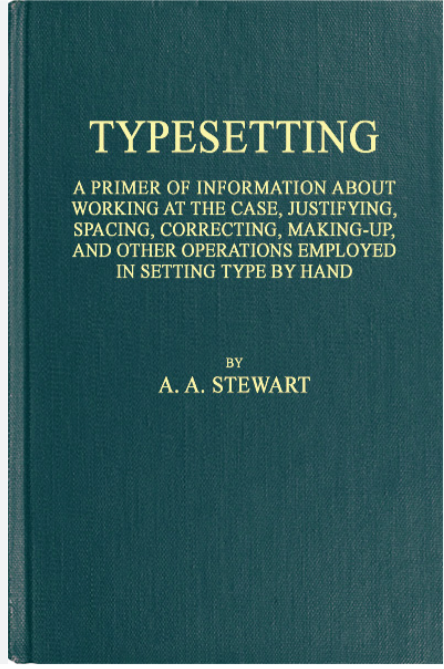
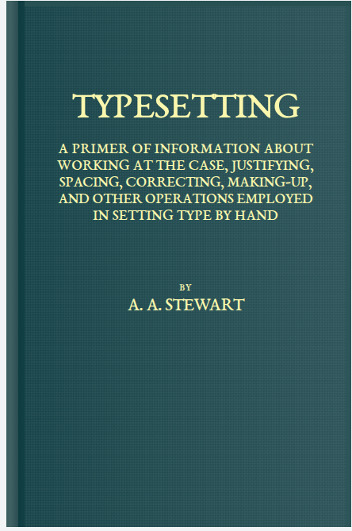

---
disclaimer:
  notice: >-
    No information within this document should be taken for granted.
    Any statement or premise not backed by a real logical definition
    or verifiable reference may be invalid, erroneous, or a hallucination.
  generated_by: "Claude Opus 4.8 via Claude Code (FrameGraph MCP server)"
  date: "2026-07-15"
title: "Lesson 01 — Reconstruct a book cover"
---

# Lesson 01 — Reconstruct a book cover

**Goal:** rebuild a photograph of a cloth book binding as a FrameGraph document —
no pasted pixels, every mark a `rect`, a gradient, a pattern or a text run — and
prove the result matches by measurement rather than by eye.

| | |
|---|---|
| Target | [`target/lesson-01.png`](target/lesson-01.png) — 444×669 px |
| Result | [`render/reconstruction.png`](render/reconstruction.png) |
| Client | [`static/examples/lesson_01_book_cover.py`](../../../static/examples/lesson_01_book_cover.py) |
| Outcome | 8/8 text lines placed within **3 px**; 96% pixel-match overall |

<div style="display:flex;gap:1rem;align-items:flex-start">
  <figure style="margin:0;flex:1">
    
    <figcaption><em>Source photograph</em></figcaption>
  </figure>
  <figure style="margin:0;flex:1">
    
    <figcaption><em>FrameGraph reconstruction</em></figcaption>
  </figure>
</div>

The subject is the binding of *Typesetting: A Primer of Information About Working
at the Case* (A. A. Stewart, 1918) — a fitting first lesson, since the book is
itself about setting type by hand.

!!! warning "What this lesson is really teaching"
    The point is **not** "the MCP server can trace an image." It is that every
    number in the final client was *derived from a measurement*, and that the
    claim "this matches" was **tested**, not asserted. A reconstruction you have
    not diffed against its source is an unverified claim (PALS's Law).

---

## The calls, in the order they were made

### 1. `measure_image` — establish the coordinate frame

The first call does not draw anything. It turns the raster into a coordinate
reference: a grid, edge rulers, exact structural anchors, and zoom crops whose
rulers stay labelled in **source** pixels.

```jsonc
measure_image({
  image: "docs/tutorial/lesson-01/target/lesson-01.png",
  session_id: "lesson-01",
  grid_step: 40,
  zooms: [ { name: "title",  box: [0.10, 0.14, 0.80, 0.12] },
           { name: "byline", box: [0.25, 0.49, 0.50, 0.12] },
           { name: "corner", box: [0.00, 0.00, 0.22, 0.15] } ]
})
```

**Returned:** `coordinate_system` (444×669, origin top-left, +y down), the exact
anchors `A1..A9`, and per-crop `origin_px` + `scale` with the inverse transform
`source_px = origin_px + read_px / scale`.

**What it decided:** the `corner` zoom (10.2× magnification) showed the thing the
whole lesson turns on — *the photograph is not the cover*. There is a white paper
margin, then a lighter band where the cloth rolls over the spine hinge. The cover
plate is inset, so page-centre and cover-centre are **not** the same point.

!!! tip "Structural vs detected anchors"
    `A1..A9` are exact geometry. The `L01..L06` landmarks in the same payload are
    CV guesses — here they all clustered near the image centroid (confidence
    0.06–0.6) and were worth nothing. Anchor to the `A*` set; treat `L*` as hints.

### 2. `detect_regions` — the call that failed (keep this one)

The natural next move is to ask what closed regions the image contains:

```jsonc
detect_regions({
  image: "docs/tutorial/lesson-01/target/lesson-01.png",
  session_id: "lesson-01-regions",
  method: "flat",
  tunables: { colors: 6, min_area: 200 }
})
```

**Returned:** 29 regions, and the largest one carried **3,754 holes** — its
"polygon" a shredded 400-vertex outline of nothing.

**Why:** `detect_regions` partitions *flat* colour. This is a photograph of woven
cloth: the weave is noise at exactly the scale the detector is looking for, so it
shattered the cover into confetti. **A tool returning `ok: true` is not the same
as a tool returning something true.**

It was not a total loss — the sampled fill of the largest region, `#17444A`, was
the first honest read of the cloth colour. But the geometry was discarded.

**The lesson:** `detect_regions` and `vectorize_image` are for flat vector art —
diagrams, logos, line work. For a photograph of a *textured physical object*, the
structure has to come from profiles and typography, not region-finding.

### 3. Measuring what MCP does not measure

No MCP tool extracts glyph cap-bands or font metrics, so three plain Python
passes did the numeric work. Being explicit about this boundary matters — it is
the difference between "the tool told me" and "I know":

| Measurement | Method | Result |
|---|---|---|
| Board & hinge bounds | luminance column profile | white margin `x 0–7`; board `x 8–442`, `y 1–663`; spine roll `x 8–22`; hinge shadow `x 23–30` |
| Cloth colours | median of patches | ground `#214C51`, gradient `#154349` → `#2D555A`, roll `#416264`, hinge `#0D3C40`, gold `#FAF7AD` |
| Text geometry | gold-ink mask, row runs | 8 lines; title cap-top `y=121`, cap height `32 px`; subtitle leading `21 px`; all lines centred on **x ≈ 234** |
| Font sizes | real `sCapHeight/unitsPerEm` via fontTools | EB Garamond cap/em = `0.658` → `size = cap_px / 0.658` |
| Weave pitch | FFT of a text-free patch | `3.2 px` pitch, amplitude only ±4.4 grey levels |

Two of these numbers changed the design outright:

- **Text centres on x ≈ 234, not 222.** The canvas centre is 222; the *front
  board* runs `x 28–442`, whose centre is 235. The type was never centred on the
  photo — it is centred on the board. Eyeballing would have buried a 12 px error.
- **No font needs positive tracking.** Solving each candidate face's own advance
  widths against the measured line widths showed every font needed a *negative*
  correction. The cover is not letterspaced. My first pass had invented tracking
  to make it "look right", and it was simply wrong.

The face was chosen by the same arithmetic — the smallest, most consistent
correction wins:

| Face | `TYPESETTING` needs | `A. A. STEWART` needs | subtitle needs |
|---|---|---|---|
| **EB Garamond** | **−0.83 px** | **−0.67 px** | **−0.36 px** |
| Linux Libertine O | −1.19 px | −1.28 px | −0.41 px |
| Liberation Serif | −3.68 px | −2.09 px | −1.20 px |
| DejaVu Serif | −4.23 px | −2.07 px | −1.52 px |

EB Garamond's subtitle needs essentially **zero** tracking (−0.39 to +0.18 px
across five lines). That is not proof it is the 1918 face — it is evidence it is
metrically very close, and it is the honest basis for choosing it.

### 4. `run_sdk_code` — the build/validate/render loop

```jsonc
run_sdk_code({ session_id: "lesson-01-build", code: "<the SDK client>" })
```

**Returned:** `validation.ok: true`, a rendered SVG + PNG, and the block that
matters most here — `diagnostics.font_fallbacks: []`.

!!! danger "Check `font_fallbacks` on every render"
    An empty `font_fallbacks` is the only evidence the face you *named* is the
    face that was *drawn*. Font substitution is silent: ask for a face that is not
    installed and you get a sans-serif that renders happily and validates
    perfectly, and every width you solved is meaningless.

### 5. The geometry diff — where the real correction came from

The first render *looked* right. The gold-mask diff, run against the render
exactly as against the source, said otherwise:

```
line 0 (TYPESETTING):  Δy = −26 px   Δw = +26 px
line 1 (subtitle):     Δy = −10 px   Δw = +13 px
line 7 (A. A. STEWART):Δy = −13 px   Δw = +24 px
```

Two systematic errors, invisible at a glance:

1. **Everything sat too high, scaling with font size** (−26 at 48.6 px, −10 at
   19.8 px, −7 at 13.7 px → ≈ −0.52 × size). A constant ratio means a *formula*
   error, not a nudge.
2. **Everything was too wide** — the tracking I had invented, plus too broad a face.

Rather than tune a magic constant, the fix came from reading what the renderer
actually emits:

```xml
<text y="110.836" text-anchor="middle" dominant-baseline="central" ...>
```

It centres text on the box's vertical centre. The measured cap-centre of that
line was `111`; the box centre was `110.836`. So the rule is exact:

> **The renderer lands the cap-height centre on the box centre.**

Which makes placement derivable instead of fiddled:

```python
size = cap_px / CAP_EM          # cap band -> font size
cy   = cap_top + cap_px / 2     # measured cap centre
box  = [cx - 210, cy - box_h/2, 420, box_h]
```

### 6. `run_sdk_client` — run the committed client

```jsonc
run_sdk_client({ path: "static/examples/lesson_01_book_cover.py",
                 session_id: "lesson-01-final" })
```

The client exposes `build()`, which is how the server finds the document.
(Re-running a *changed* client in a session that already rendered can serve the
old artifact — use a fresh `session_id` when you expect a rebuild.)

### 7. `compare_images` — the verdict

```jsonc
compare_images({
  reference: "docs/tutorial/lesson-01/target/lesson-01.png",
  candidate: "framegraph://session/lesson-01-final/page/1.png",
  session_id: "lesson-01-compare",
  regions: [ { name: "title",    box: [0.12, 0.16, 0.78, 0.09] },
             { name: "subtitle", box: [0.12, 0.26, 0.78, 0.16] },
             { name: "byline",   box: [0.30, 0.52, 0.42, 0.07] },
             { name: "spine",    box: [0.00, 0.30, 0.14, 0.30] } ]
})
```

| Region | pixel-match | NCC | Reading |
|---|---|---|---|
| overview | 95.6% | 0.837 | the cover as a whole |
| spine | 97.3% | **0.991** | gradients + hinge are essentially exact |
| byline | 90.2% | 0.445 | |
| title | 87.0% | 0.366 | |
| subtitle | 87.4% | 0.498 | |

**Read these numbers correctly.** The text panels score *worst* while being
placed within 3 px — because any sub-pixel difference in glyph edge lights up the
entire letterform in the diff. The residual is real but it is not
mis-*placement*: it is photographic ink bloom (gold on cloth halates; vector
glyphs have crisp edges) and cloth irregularity against a regular pattern. A low
NCC on a text region is a statement about *rendering*, not *geometry* — which is
exactly why the geometry diff in step 5 is a separate instrument.

---

## Final geometry

Measured on the committed render, the same way as the source:

| line | cap-top Δy | width Δw | centre Δx |
|---|---|---|---|
| `TYPESETTING` | −3 px | −2 px | +0.0 px |
| `subtitle 1` | +0 px | +0 px | +0.0 px |
| `subtitle 2` | −1 px | −2 px | +0.0 px |
| `subtitle 3` | −1 px | −3 px | +0.5 px |
| `subtitle 4` | +0 px | −2 px | +0.0 px |
| `subtitle 5` | −1 px | −2 px | −1.0 px |
| `BY` | +0 px | +0 px | +0.0 px |
| `A. A. STEWART` | −1 px | −3 px | +0.5 px |

**8/8 lines matched, max |Δy| = 3 px, max |Δw| = 3 px, max |Δx| = 1 px.**

## What is honestly *not* matched

- **The face is a stand-in.** EB Garamond is metrically closest of the installed
  serifs; the 1918 original was some Caslon/Modern cut not identified here.
- **The weave is a regular grid**, measured to the right pitch and amplitude, but
  real cloth is irregular. `sdk.humanize` is the tool for that; it is not used here.
- **No ink bloom.** The gold letterpress halates into the cloth. This is the bulk
  of the remaining title/subtitle diff.
- **The board is a rectangle** — no corner rounding or page-block edge.

## Run it yourself

```bash
uv run python static/examples/lesson_01_book_cover.py   # -> _tmp/lesson-01/
```

## What to take away

1. **Establish the coordinate frame before drawing anything** (`measure_image`).
   The cover-centre-vs-page-centre trap is caught here or it is never caught.
2. **A successful call is not a correct answer.** `detect_regions` returned
   `ok: true` and 29 regions of garbage. Match the instrument to the material.
3. **Solve numbers, do not nudge them.** Cap heights from real font metrics;
   tracking from real advance widths; placement from what the renderer emits.
4. **Check `font_fallbacks` on every render**, or your solved widths are fiction.
5. **Use two instruments.** `compare_images` shows *where* it is off; a geometry
   diff says *how far*. The title region scores 87% while sitting 3 px true —
   only one of those numbers answers "is it in the right place?"

---

*Back to [the tutorial index](../index.md) · the [Python SDK guide](../../sdk.md)
· the [examples cookbook](../../examples.md)*
