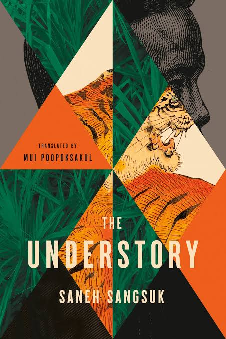
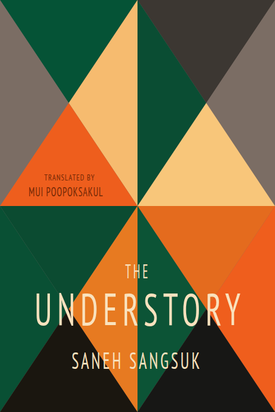

---
disclaimer:
  notice: >-
    No information within this document should be taken for granted.
    Any statement or premise not backed by a real logical definition
    or verifiable reference may be invalid, erroneous, or a hallucination.
  generated_by: "Claude Opus 4.8 via Claude Code (FrameGraph MCP server)"
  date: "2026-07-15"
title: "Lesson 02 — Reconstruct a geometric cover"
---

# Lesson 02 — Reconstruct a geometric cover

**Goal:** rebuild a modern book cover — a mosaic of flat colour over a
photographic collage — as a FrameGraph document, deriving the lattice from the
pixels rather than guessing it, and reporting where a vector reconstruction
*cannot* follow the source.

| | |
|---|---|
| Target | [`target/lesson-02.jpg`](target/lesson-02.jpg) — 452×678 px |
| Result | [`render/reconstruction.png`](render/reconstruction.png) |
| Client | [`static/examples/lesson_02_book_cover.py`](../../../static/examples/lesson_02_book_cover.py) |
| Outcome | 5/5 text lines within **1 px** of their cap band; the lattice exact (16 faces tiling 452×678 to the pixel); **6 of 16 fills exact, 10 reduced**; 92% pixel-match overall |

<div style="display:flex;gap:1rem;align-items:flex-start">
  <figure style="margin:0;flex:1">
    
    <figcaption><em>Source cover</em></figcaption>
  </figure>
  <figure style="margin:0;flex:1">
    
    <figcaption><em>FrameGraph reconstruction</em></figcaption>
  </figure>
</div>

The subject is the cover of *The Understory* by Saneh Sangsuk, translated by
Mui Poopoksakul. Lesson 01 rebuilt a **photograph of a physical object**;
this one rebuilds **flat graphic design** — and the difference in material
changes which instruments work.

!!! warning "What this lesson is really teaching"
    Lesson 01's moral was *match the instrument to the material*. This cover is
    a hybrid — a flat vector lattice over a photographic collage — and it makes
    the point sharper: **the same tool succeeds and fails inside one image.**
    The job is not to find a tool that works. It is to know, per region, which
    of your numbers are measurements and which are reductions — and to publish
    that distinction as a column in the table.

---

## The calls, in the order they were made

### 1. `measure_image` — the coordinate frame, and a node

```jsonc
measure_image({
  image: "docs/tutorial/lesson-02/target/lesson-02.jpg",
  session_id: "lesson-02-measure",
  grid_step: 40,
  detect_landmarks: false,
  zooms: [ { name: "title",       box: [0.05, 0.60, 0.90, 0.15] },
           { name: "translator",  box: [0.05, 0.38, 0.45, 0.12] },
           { name: "centre-node", box: [0.35, 0.42, 0.30, 0.20] } ]
})
```

**Returned:** a 452×678 top-left frame and the exact anchors `A1..A9`.

**What it decided:** the `centre-node` crop (7.55×) showed a hard vertical seam
at `x=226` and several triangles radiating from a single point at **`A9`
(226, 339) — the exact page centre**. The mosaic is anchored to the page, not
floating on it. That one observation is what made a *derived* lattice possible
instead of a traced one.

### 2. `detect_regions` — the call that half-worked (keep this one)

```jsonc
detect_regions({
  image: "docs/tutorial/lesson-02/target/lesson-02.jpg",
  session_id: "lesson-02-regions",
  method: "flat",
  tunables: { colors: 6, min_area: 400 },
  max_regions: 40
})
```

**Returned:** 40 regions. The largest carried **486 holes**; others carried 398
and 176. The tiger's stripes, the engraving's hatching and the grass blades are
noise at exactly the scale the fill-partition detector looks for, so it shredded
those faces — the same failure as lesson 01.

**But it did not fail uniformly.** Two regions came back with **zero holes**:

| id | bbox | fill | holes |
|---|---|---|---|
| 38 | `[0, 1, 78, 335]` | `#7A6C63` | **0** |
| 37 | `[378, 0, 74, 339]` | `#7A6C63` | **0** |

Those are the grey wedges at the left and right edges — the only places where
the artwork really *is* flat colour. **The instrument succeeded exactly where the
material matched it and shattered everywhere else, inside one image.** That is a
more useful result than a clean failure, and it is why the `spread` column in
step 4 exists.

One number in the debris was load-bearing: region 33's polygon ran
`(0,0) → (110,166) → (224,1)`, i.e. a triangle `(0,0), (113,169.5), (226,0)`.
With `452/4 = 113` and `678/4 = 169.5`, that is a lattice hypothesis worth testing.

!!! danger "A per-type `describe_capabilities` can exceed the token cap"
    `describe_capabilities({topic: "circle"})` inlines every `$def` — 65,468
    characters for one shape, and `topic: "style"` is 48.9 KB. The compact index
    (no topic) is fine; for a type, read the saved payload with
    `jq '{topic, kind, fields}'` rather than pulling the whole schema into context.

### 3. Testing the lattice — where the guess died

The 4×4 hypothesis predicts horizontal seams at `y = 169.5, 339, 508.5`. Measuring
the mean absolute colour jump across every horizontal cut in the image:

| cut | jump | percentile of all rows |
|---|---|---|
| `y=169` | 15.54 | 47th |
| **`y=339`** | **52.36** | **98.8th** |
| `y=508` | 13.14 | 29th |

**Only the centre line exists.** The other two are *below average* — there is no
4-row grid. (The other strong cuts, at `y≈481`, `537` and `606`, turned out to be
the title and byline cap-bands, not lattice at all.)

So the triangles meet at **points**, not along horizontal bases. Guessing was
over; the lines had to be detected. A Hough transform over a mean-shift-posterized
copy (posterizing first is what kills the illustration texture):

| segment | length | slope |
|---|---|---|
| `(225,571)→(225,2)` | 569 px | vertical |
| `(116,505)→(334,175)` | 395 px | −1.51 |
| `(181,271)→(338,504)` | 281 px | +1.48 |
| `(78,219)→(226,0)` | 264 px | −1.48 |
| `(10,339)→(231,339)` | 221 px | 0.00 |

Total length per angle bin: **1235 px at 123°** and **1182 px at 57°** — i.e.
slope **±1.5**, which is exactly `(H/4)/(W/4) = 169.5/113`. Eight long segments
extend to within 6 px of the page centre.

### 4. The arrangement — 16 faces, and an honesty column

The eight measured lines (six diagonals of slope ±1.5 through the grid points
`(113i, 169.5j)`, plus `x=226` and `y=339`) were intersected with the page
rectangle by half-plane clipping, giving each face as an exact convex polygon.
Each face's fill is the **median** of its source pixels; `spread` is the median
absolute deviation from that median.

```
faces (>=250px): 16   total area 306456 of 306456
```

**16 faces, every one of area 19154, summing to exactly 452 × 678.** A perfect
tiling — that is the check that the lattice is right, and it is arithmetic, not
opinion. Two independent methods also agreed on the background: `detect_regions`
sampled `#7A6C63`, the median said `#7B6D64`.

`spread` is the whole point:

| spread | faces | what it means |
|---|---|---|
| 0–8 | 6 | genuinely flat colour — reconstructs **exactly** |
| 28–44 | 5 | grass texture under green — flat fill is close |
| 68–122 | 5 | tiger / engraving — flat fill is a **reduction, not a match** |

Every fill in the client carries its spread. The reader can see which six faces
are true and which ten are honest approximations, without taking anyone's word.

### 5. Measuring type — and the band that lied twice

The cream lines segmented cleanly. `UNDERSTORY` gave **10 column runs for 10
letters**, pitch 33–39 px (mean 35.1), centre `x=226.0` — the page centre exactly.
`TRANSLATED BY` / `MUI POOPOKSAKUL` centre on `x≈115 ≈ 113 = W/4`: the translator
block is centred on a **lattice column**, not on the page.

The dark lines fought back. A colour mask cannot separate dark ink on orange from
**tiger stripes**, which are also dark on orange, and two successive attempts
disagreed with each other *and* with the zoom crop:

| pass | `TRANSLATED BY` cap | `MUI POOPOKSAKUL` cap |
|---|---|---|
| wide band | 21 | 15 |
| tighter band | 11 | **24** |
| **row profile, x∈[40,160]** | **10** | **15** |

The second pass had `TRANSLATED BY` reading *taller* than `MUI POOPOKSAKUL`,
which the 5× zoom plainly contradicts. Only a **row profile** — counting dark
columns per row across the clean part of the orange wedge — separates them, and
it shows why: bands `y=304..307` and `y=323..327` carry 6–12 stray columns of
tiger, while the type itself is two isolated blocks at `287..296` and `308..322`.

**A measurement that contradicts a picture is not a measurement.** Both earlier
passes would have validated, rendered, and been wrong.

### 6. `list_fonts` — the face does not exist here

```jsonc
list_fonts({ contains: "condensed", limit: 60 })
```

**Returned:** 22 families. None is close. Solving each candidate's real glyph
bounds at the size that makes cap height 57 px:

| face | mean ink width | needed | error |
|---|---|---|---|
| *measured on the source* | — | **21.9 px** | — |
| PT Sans Narrow | 32.7 px | 21.9 | **+49%** |
| Roboto Condensed | 35.9 px | 21.9 | +64% |
| Fira Sans Condensed Heavy | 43.9 px | 21.9 | +100% |

The cover's ink/cap ratio is **0.384**; the narrowest installed face is **0.574**.
The face is an ultra-condensed gothic that is simply not in this runtime.

!!! danger "`fc-match` substitutes silently — check what you actually got"
    **Oswald, Anton, League Gothic, Archivo Narrow, Barlow Condensed** and
    **Encode Sans Condensed** all resolve to **Noto Sans**. `fc-match` returns a
    substitute with no error and no warning, and every width you then solve is
    fiction. This is lesson 01's `font_fallbacks` rule one layer lower down:
    resolve the family *before* you trust a metric taken from it.

### 7. Solving type against a face that is wrong

With no correct face available, two unknowns are solved per line — and both are
declared in the client rather than buried:

```python
size = cap_px / CAP_EM                    # cap height matches exactly
K    = ink_measured / ink_natural(size)   # x-compression -> letter PROPORTION
ls   = (target_w / K - Σadvance + lsb(first) + rsb(last)) / (n - 1)
```

`K` came out **0.61–0.86 across five independently measured lines** (mean 0.674)
— consistent evidence of one face, uniformly ~32% too wide. `K` costs horizontal
stroke weight; that is the deviation, and it is named in the client's docstring.

### 8. `run_sdk_client` → geometry diff → two root causes

```jsonc
run_sdk_client({ path: "static/examples/lesson_02_book_cover.py",
                 session_id: "lesson-02-build" })
```

The first render *looked* right. `font_fallbacks: []` confirmed PT Sans Narrow was
genuinely drawn. The geometry diff — measuring the render with the identical mask
used on the source — disagreed:

```
UNDERSTORY   Δcap_top=+0   ΔcapH=+5   Δwidth=-8
```

Two separate defects, neither fixable by nudging:

1. **ΔcapH +5.** The `OS/2.sCapHeight` table value alone rendered 61 px where the
   source measures 56 — the round letters (`O`, `S`) overshoot the cap line. Fixed
   by one Newton step against the render, measured with the same mask on both
   sides: a closed loop, not a magic constant.
2. **Δwidth −8.** A bug in the solve, not the render: `letter_spacing` was solved
   against the **advance** sum while the diff measures **ink** extent. The first
   glyph's left side-bearing and the last glyph's right side-bearing live inside
   the advances and outside the ink — 5.2 px on the title, ×`K`. Adding
   `+ lsb(first) + rsb(last)` took Δwidth from **−8 to −4** across the board.

A third pass silenced 4 containment warnings by clamping each text box to the
canvas. The rendered SVG's sha256 was **unchanged** (`b10e0423…`) — proof the fix
moved no glyph.

### 9. `compare_images` — the verdict, and a metric that inverts

```jsonc
compare_images({
  reference: "docs/tutorial/lesson-02/target/lesson-02.jpg",
  candidate: "framegraph://session/lesson-02-v4/page/1.png",
  session_id: "lesson-02-compare",
  regions: [ { name: "translator",  box: [0.05, 0.39, 0.42, 0.09] },
             { name: "title",       box: [0.08, 0.69, 0.84, 0.10] },
             { name: "byline",      box: [0.22, 0.84, 0.56, 0.06] },
             { name: "centre-node", box: [0.35, 0.42, 0.30, 0.16] },
             { name: "grey-wedge",  box: [0.00, 0.05, 0.16, 0.35] } ]
})
```

| region | pixel-match | NCC | MAE |
|---|---|---|---|
| grey-wedge | **96.1%** | 0.703 | **10.4** |
| translator | 94.1% | 0.902 | 17.3 |
| overview | 92.1% | 0.853 | 21.7 |
| centre-node | 92.0% | 0.900 | 23.2 |
| title | 86.1% | **0.709** | 37.9 |
| byline | 85.4% | 0.645 | 39.4 |

**Read this table carefully, because one column is lying.** NCC ranks the
grey wedge — 96.1% matched, MAE 10.4, the single most accurate region on the
page — as *worse* than the title at 86.1% and MAE 37.9. NCC correlates
*variation*, and a flat face has almost none, so the statistic is degenerate
exactly where the reconstruction is best. **On flat regions read MAE; keep NCC
for textured ones.** The tool's own guidance says the panels are the signal and
the scores are hints; this is what that means in practice.

The title and byline diffs glow as letterform **outlines**, not offsets — the
type is in the right place and the wrong shape. That is `K` made visible.

---

## Final geometry

Measured on the committed render, with the same mask used on the source. The two
translator lines are compared against the **row-profile** figures from step 5,
not the contaminated band:

| line | Δcap_top | ΔcapH | Δwidth | Δcentre |
|---|---|---|---|---|
| `TRANSLATED BY` | 0 | 0 | −2 px | 0.0 |
| `MUI POOPOKSAKUL` | 0 | 0 | −1 px | −0.5 |
| `THE` | +1 px | −1 px | 0 | −1.0 |
| `UNDERSTORY` | +1 px | −1 px | −4 px | +1.0 |
| `SANEH SANGSUK` | 0 | 0 | −1 px | −0.5 |

**5/5 lines: max |Δcap_top| = 1 px, max |ΔcapH| = 1 px, max |Δwidth| = 4 px,
max |Δcentre| = 1.0 px.**

Mosaic: the **geometry** is exact — 16 faces of area 19154, totalling
306456 = 452 × 678, no gaps and no overlaps. The **colour** is exact on the six
faces with `spread ≤ 8` and averaged on the other ten. Those are two different
claims and this lesson does not merge them.

## What is honestly *not* matched

- **The illustration is gone.** This is the big one. Ten of sixteen faces carry a
  photographic collage — jungle grass, a tiger illustration, an engraved portrait
  — reduced to a single median colour. `spread` says exactly how much was thrown
  away: 122 on the tiger's head, 106 on the engraved face, 95 on the cream wedge.
  **The six faces with spread ≤ 8 are reconstructions; the ten above are
  reductions.** No vector lattice recovers a photograph, and none is claimed.
- **The face is wrong, by a measured 49%.** PT Sans Narrow compressed to `K≈0.67`
  hits the right cap height, width, tracking and centre, but its letterforms are
  not the cover's, and horizontal compression thins the stems. The right fix is
  installing the real face or drawing the display type as outlines
  (`sdk.outline`); neither is done here.
- **`y=339` is drawn as a full-width seam.** The Hough segment spans only
  `x=10..231`. On the right half the faces meet with no visible edge; the
  reconstruction splits them anyway. Invisible where the fills agree, wrong in
  principle.
- **No JPEG character.** The source is a JPEG with soft, haloed edges; the
  reconstruction has crisp vector ones. This is most of the residual in the
  otherwise-flat regions.

## Run it yourself

```bash
uv run python static/examples/lesson_02_book_cover.py   # -> _tmp/lesson-02/
```

## What to take away

1. **One tool can succeed and fail inside one image.** `detect_regions` returned
   two perfect zero-hole faces and fourteen shredded ones. Judge per region, not
   per call.
2. **Publish the honesty column.** `spread` costs nothing to compute and turns
   "here is the palette" into "here are six colours I measured and ten I
   averaged". A reconstruction that cannot say which is which is a claim.
3. **A tiling that sums exactly is a proof.** 16 × 19154 = 452 × 678 verified the
   lattice before a single face was drawn. Prefer checks that arithmetic can settle.
4. **Kill your hypothesis early.** `y=169.5` sat at the 47th percentile — the
   4-row grid was dead in one cheap test, before it could cost anything.
5. **A measurement that contradicts a picture is not a measurement.** Two type
   passes disagreed with the zoom and with each other. Both would have rendered.
6. **Check what `fc-match` gave you, not what you asked for.** Six named faces all
   silently became Noto Sans.
7. **The diff needs the same care as the measurement.** Half the apparent cap
   errors were the diff script re-measuring the source through a tiger.

---

*Back to [the tutorial index](../index.md) · [Lesson 01](../lesson-01/index.md)
· the [Python SDK guide](../../sdk.md) · the [examples cookbook](../../examples.md)*
