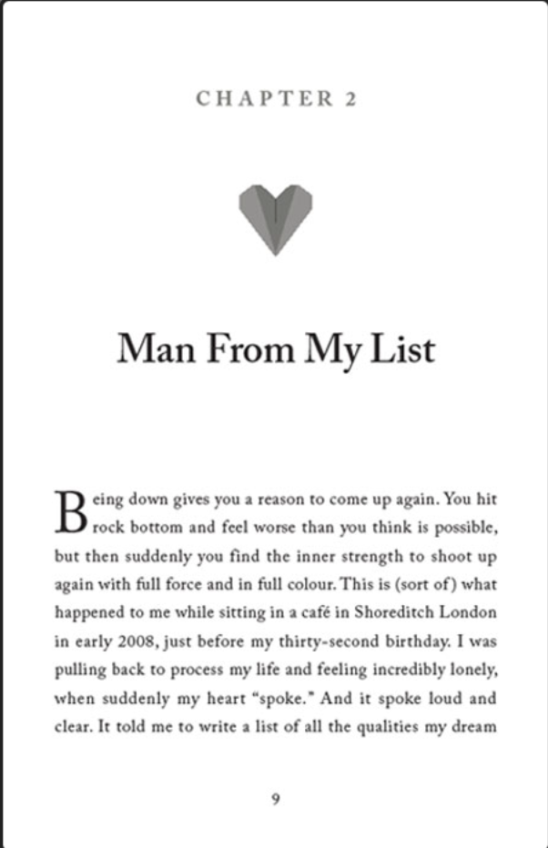
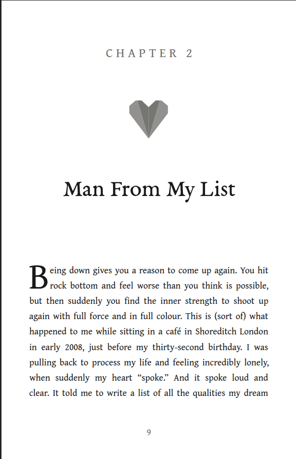

---
disclaimer:
  notice: >-
    No information within this document should be taken for granted.
    Any statement or premise not backed by a real logical definition
    or verifiable reference may be invalid, erroneous, or a hallucination.
  generated_by: "Claude Opus 4.8 via Claude Code (FrameGraph MCP server)"
  date: "2026-07-15"
title: "Lesson 03 — Reconstruct a typeset page"
---

# Lesson 03 — Reconstruct a typeset page

**Goal:** rebuild a chapter-opening book page — tracked label, origami ornament,
display title, two-line drop cap, and nine lines of **justified** body text — as
a FrameGraph document, and prove it matches by measurement.

| | |
|---|---|
| Target | [`target/lesson-03.png`](target/lesson-03.png) — 602×932 px |
| Result | [`render/reconstruction.png`](render/reconstruction.png) |
| Client | [`static/examples/lesson_03_chapter_page.py`](../../../static/examples/lesson_03_chapter_page.py) |
| Outcome | 13/13 elements within **2 px**; every justified line's right edge exact; 98.3% pixel-match |

<div style="display:flex;gap:1rem;align-items:flex-start">
  <figure style="margin:0;flex:1">
    
    <figcaption><em>Source page</em></figcaption>
  </figure>
  <figure style="margin:0;flex:1">
    
    <figcaption><em>FrameGraph reconstruction</em></figcaption>
  </figure>
</div>

[Lesson 01](../lesson-01/index.md) reconstructed a *photograph*: its numbers came
from colour profiles and edges. This page is **typesetting**. Almost nothing here
is a colour; it is a face, a size, a baseline, a measure, and a justifier. So the
instruments change — and one of them turns out to be broken.

!!! warning "The finding, up front"
    `text_align: justify` is a **silent no-op** on FrameGraph's SVG text. The
    model accepts it, the validator returns `ok: true`, the renderer emits it into
    the SVG, and nothing justifies. The first draft of this page rendered
    ragged-right while reporting a clean bill of health. See [step 5](#5-the-no-op).

---

## The calls, in the order they were made

### 1. `measure_image` — the coordinate frame

```jsonc
measure_image({
  image: "docs/tutorial/lesson-03/target/lesson-03.png",
  session_id: "lesson-03",
  grid_step: 40,
  detect_landmarks: false,
  zooms: [ { name: "dropcap",       box: [0.08, 0.61, 0.45, 0.09] },
           { name: "ornament",      box: [0.38, 0.27, 0.24, 0.12] },
           { name: "chapter-label", box: [0.30, 0.13, 0.40, 0.06] } ]
})
```

**Returned:** `coordinate_system` 602×932, origin top-left, and the anchors
`A1..A9`.

**What it got wrong — mine, not the tool's.** Two of the three zoom boxes missed:
the `ornament` crop caught mostly white, and `chapter-label` caught nothing but
grid. I had guessed the boxes before looking at the overlay. **Aim zooms from the
overlay, not from a hunch** — the overlay is free, and a missed crop costs a whole
round-trip.

### 2. Finding the page inside the frame

The first ink-band pass returned **one band covering the whole image**. The source
carries a thin dark rule down the left edge (`x 0–2`) and across the top (`y 0`) —
a crop artifact of the screenshot — which welds every row together.

Excluding it gave the page's real structure:

| Element | Band | Note |
|---|---|---|
| `CHAPTER 2` | `y 100–115`, `x 216–388` | cap 16 px, widely tracked |
| ornament | `y 204–280`, `x 263–341` | |
| `Man From My List` | `y 365–410`, `x 129–477` | |
| body | `y 539–809`, `x 60–545` | **9 lines, every one flush to both margins** |
| folio `9` | `y 872–883` | |

Body lines run `60 → 545` on **every** line. That is justified text, and it sets
up the lesson's central problem. The rules are reproduced in the client — they
are in the target, so they are in the pixel-match.

### 3. `detect_regions` — the tool that failed in lesson 01 works here

```jsonc
detect_regions({
  image: "<the ornament, cropped to 95x94>",
  session_id: "lesson-03-heart",
  method: "flat",
  tunables: { colors: 5, min_area: 40 }
})
```

**Returned:** 4 regions with clean polygons — the white ground (with the heart as
a hole), two light wings at `#91908E`, and the dark inner facets at `#757572`.

This is the **same call, with the same method**, that shattered lesson 01's cloth
into 29 regions and 3,754 holes. The difference is the material, not the tool:
flat vector-like shading partitions cleanly; photographed weave does not. The
lesson generalises — *a tool is not good or bad, it is matched or mismatched to
the material.*

The detector's polygons are simplified, so a row-by-row trace pinned the exact
geometry, which turned out to be strictly regular:

- axis of symmetry at **x = 302.25** (constant across every row);
- the tone boundary is a **straight crease** from `(279.5, 204)` to the bottom
  point — not a curve;
- the top notch closes at `(302.25, 217.5)`;
- the outer edge has a flat vertical section (`y 215–230`) — folded paper.

So the ornament is four polygons, two of them mirrored. It scores **98.6%**
(NCC 0.982) — the best-matching region on the page.

### 4. Solving the type — where justification helps and hurts

**The trap:** you cannot solve the body size from line width. Every line is
485 px wide *because the justifier made it so*. Line width measures the
justifier, not the font.

**The way through:** justification stretches the **spaces**, not the glyphs. So
individual *words* are unstretched and carry the real metrics. Line 9 segmented
into all 14 words cleanly:

```
clear.(41)  It(11)  told(31)  me(22)  to(15)  write(40)  a(7)
list(23)  of(18)  all(18)  the(24)  qualities(66)  my(23)  dream(49)
```

Solving `size = measured_width / natural_ink_width` for each word across every
installed serif, the winner is the face whose solved sizes **agree with each
other** (low spread):

| Face | solved size | spread (sd) | predicted x-height (Δ vs 8.5) | predicted ascender (Δ vs 14.0) |
|---|---|---|---|---|
| **Gentium Book Plus** | **18.29 px** | **0.27** | 8.31 (**−0.19**) | 13.84 (**−0.16**) |
| PT Serif | 17.43 px | 0.33 | 8.71 (+0.21) | 13.11 (−0.89) |
| DejaVu Serif | 15.46 px | 0.32 | 8.03 (−0.47) | 11.75 (−2.25) |
| Linux Libertine O | 19.19 px | 0.50 | 8.23 (−0.27) | 13.39 (−0.61) |
| EB Garamond | 19.94 px | 0.69 | 8.07 (−0.43) | 13.58 (−0.42) |

Width alone barely discriminates (0.27 vs 0.32 is not a verdict). **Three
independent measurements agreeing is.** Gentium Book Plus wins on word widths,
x-height *and* ascender simultaneously — that is evidence; a single tight fit
would only have been a coincidence.

The drop cap confirmed it independently: solving Gentium's `B` from its height
(73.82 px) and from its width (72.50 px) agrees to **0.982** — and its baseline
lands at **586.0**, which is exactly line 2's measured baseline. A classic
two-line drop cap, arrived at by arithmetic rather than assumption.

!!! failure "The title face is not installed — and I am not going to pretend otherwise"
    The title's width/cap ratio is **10.58**. Sweeping **654 installed faces** for
    that ratio returned only sans faces (Inter Display, Lato) — visually absurd for
    a high-contrast serif. Re-solving with tracking as a free parameter demanded
    implausible values (EB Garamond SmallCaps at **−7.29 px/gap**).

    No installed face reproduces the title's width *and* cap height together.
    EB Garamond is used as a **stand-in**: at 48.37 px it matches the width exactly
    with zero tracking, and its cap is 1.17 px (3.5%) short. That residual is the
    bulk of the title's 89.5% score, and it is honest — not a bug to be tuned away.

### 5. The no-op

The first build set `text_align: justify` and `text_align_last: justify` on each
line, and reported:

```
validation.ok        : true
diagnostics.warnings : []
text_fit             : { total: 13, wrapped: 0, clipped: 0, contained: 13 }
```

The page rendered **ragged-right**. The emitted SVG says why:

```xml
<text y="580.374" text-anchor="start" style="...;text-align-last:justify">
  <tspan x="102">rock bottom and feel worse than you think is possible,</tspan>
</text>
```

`text-align` and `text-align-last` are **CSS properties for flowed text**. SVG
`<text>` places glyphs directly; it has no line box to align within, so Chromium
ignores both. The model accepts the field, the validator passes it, the renderer
faithfully emits it, and the result is silently wrong at every layer.

This is [ADR-0004](../../adr-0004-single-engine-layout.md)'s thesis arriving in
person: a value that is *valid* is not thereby *honoured*.

**The fix — compute the justification, because that is what justification is.**
`word-spacing` *is* honoured on SVG text. For each line, with the pen at `x0`:

```
ink_left  = x0 + xMin(first glyph)
ink_right = x0 + Σ advances[:-1] + xMax(last glyph) + word_spacing × n_spaces
```

Solve `x0` so `ink_left` hits the left margin, then `word_spacing` so `ink_right`
hits the right. The solved values are the page's real justification, and they
vary exactly as a justifier's would:

| line | word_spacing |
|---|---|
| `eing down gives you a reason…` | 1.87 px |
| `again with full force…` | 2.45 px |
| `but then suddenly you find…` | 4.27 px |
| `in early 2008, just before…` | 4.80 px |
| `when suddenly my heart “spoke.”…` | **6.15 px** — the loosest line, as it looks |

### 6. The other placement rule

Lesson 01 established that the renderer lands the **cap-height centre on the box
centre**. That rule broke here — and then un-broke, which is the interesting part.

The first (justified) build emitted **no** `dominant-baseline`, so `y` was the
alphabetic baseline. The second build, having switched `text_align` to `left`,
emitted `dominant-baseline="central"` — *changing the horizontal alignment
silently changed the vertical placement rule*, because the renderer only sets the
central baseline for a single non-justified line.

Rather than reverse-engineer a magic constant, the offset comes from the font:
`central` sits `(ascent + descent) / 2` above the alphabetic baseline.

```
Gentium Book Plus : (2250 + -750) / 2 / 2048 = 0.3662
EB Garamond       : ( 726 + -274) / 2 / 1000 = 0.2260

box_centre = baseline − k × size
```

The empirical value measured off the render was **0.3845** — agreeing with the
metric-derived 0.3662 within measurement noise, which is what makes it a rule and
not a fudge. With it, `CHAPTER 2` landed at **Δy = 0**.

### 7. Closing the loop — measure ≠ render, quantified

The metrics-solved `word_spacing` still rendered **2–4 px short** on every line:
Chromium's rasterised advances differ from fontTools' prediction by ~0.6%.

That is not a bug in either; it is the gap ADR-0004 is about. It was closed by
feeding the *measured* deficit back:

```
word_spacing += (target_right − rendered_right) / n_spaces
```

One pass took every line's right edge from −4…−2 px to **exactly 0**.

### 8. `compare_images` — the verdict

```jsonc
compare_images({
  reference: "docs/tutorial/lesson-03/target/lesson-03.png",
  candidate: "framegraph://session/lesson-03-final/page/1.png",
  session_id: "lesson-03-compare",
  regions: [ { name: "chapter-label", box: [0.30, 0.10, 0.40, 0.03] },
             { name: "ornament",      box: [0.40, 0.21, 0.20, 0.09] },
             { name: "title",         box: [0.18, 0.38, 0.64, 0.06] },
             { name: "dropcap",       box: [0.08, 0.57, 0.30, 0.06] },
             { name: "body",          box: [0.08, 0.63, 0.84, 0.24] } ]
})
```

| Region | pixel-match | NCC | Reading |
|---|---|---|---|
| overview | **98.3%** | 0.854 | the page as a whole |
| ornament | 98.6% | **0.982** | four polygons, essentially exact |
| body | 93.3% | 0.676 | placement exact; glyph edges differ |
| chapter-label | 92.9% | 0.395 | 16 px tracked caps — all edge |
| dropcap | 90.8% | 0.741 | |
| title | 89.5% | 0.621 | the stand-in face |

As in lesson 01, **the text regions score worst while being placed within 2 px**.
`chapter-label` is the extreme: NCC 0.395 on an element sitting at Δ = 0 on all
four edges. It is 16 px of hairline caps — almost every pixel is an anti-aliased
boundary, so tiny raster differences dominate a correlation over so little ink. A
low NCC on small text is a statement about *rasterisation*, not *geometry*.

---

## Final geometry

Measured on the committed render, the same way as the source:

| element | baseline Δy | left Δx | right Δx |
|---|---|---|---|
| `CHAPTER 2` | +0 px | +0 px | +0 px |
| ornament | +0 px | +0 px | −1 px |
| title | +2 px | +0 px | +0 px |
| drop cap + line 1 | +0 px | +0 px | +0 px |
| line 2 | +0 px | +0 px | +0 px |
| line 3 | −1 px | −1 px | +0 px |
| line 4 | −1 px | −1 px | +0 px |
| line 5 | −1 px | −1 px | +0 px |
| line 6 | +0 px | −1 px | +0 px |
| line 7 | −1 px | −1 px | +0 px |
| line 8 | −2 px | +0 px | +0 px |
| line 9 | −1 px | +0 px | +0 px |
| folio | +0 px | +0 px | −1 px |

**13/13 elements, max |Δy| = 2 px, max |Δright| = 1 px** — and every justified
line flush to both margins.

## What is honestly *not* matched

- **The title face is a stand-in.** No installed face fits; EB Garamond's cap is
  3.5% short. See step 4.
- **The justification is baked, not computed at render time.** Nine `word_spacing`
  values reproduce *this* page exactly; they do not re-flow. A real justifier
  (Knuth–Plass, [ADR-0003](../../adr-0003-backend-neutral-flow-layout.md)) belongs
  in the flow engine, not in a client.
- **The body's line breaks are given, not derived.** They were read off the source.
  A true flow test would let the engine break the paragraph and check whether it
  agrees — that is a different lesson.
- **No hinting model.** The source's rasteriser is not this one; body ink reaches
  `#444444` where the drop cap in the same face reaches `#130f10`. Same ink,
  different anti-aliasing.

## Run it yourself

```bash
uv run python static/examples/lesson_03_chapter_page.py   # -> _tmp/lesson-03/
```

## What to take away

1. **`ok: true` is not `correct: true`.** A clean validator, no warnings, and
   `contained: 13` all coexisted with text that did not justify.
2. **Match the instrument to the material.** `detect_regions` produced garbage on
   lesson 01's cloth and near-exact polygons on this ornament — same call, same
   method.
3. **Justification hides the size and reveals it.** Line widths measure the
   justifier; word widths measure the font.
4. **One tight fit is a coincidence; three agreeing measurements are evidence.**
   Width, x-height and ascender all chose Gentium.
5. **Derive constants from the font, not from the render.** `k = (ascent+descent)/2`
   predicted the placement the render then confirmed — that is a rule. A number
   tuned until it looked right is a fudge that breaks at the next size.
6. **Then close the loop anyway.** Even correct metrics landed 0.6% short of the
   rasteriser. Predict, render, measure, correct.

---

*Back to [the tutorial index](../index.md) · [lesson 01](../lesson-01/index.md)
· the [Python SDK guide](../../sdk.md)*
