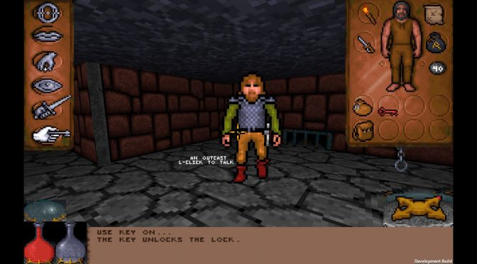
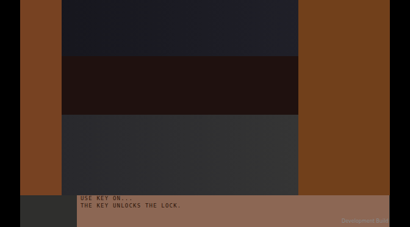

---
disclaimer:
  notice: >-
    No information within this document should be taken for granted.
    Any statement or premise not backed by a real logical definition
    or verifiable reference may be invalid, erroneous, or a hallucination.
  generated_by: "Claude Opus 4.8 via Claude Code (FrameGraph MCP server)"
  date: "2026-07-15"
title: "Lesson 04 — When not to reconstruct"
---

# Lesson 04 — When not to reconstruct

**Goal:** attempt a raster that vectors cannot carry, watch the automatic tracer
fail twice, and learn to read the moment the honest answer is *"this is the wrong
material."*

| | |
|---|---|
| Target | [`target/lesson04.jpg`](target/lesson04.jpg) — 672×372 px |
| Result | [`render/reconstruction.png`](render/reconstruction.png) — chrome only, by design |
| Outcome | **~10% of the image is honestly reconstructable.** The rest is a rendered 3D scene and hand-drawn pixel art. The headline number, 93.9% pixel-match, is **meaningless** — and proving that is the lesson |

<div style="display:flex;gap:1rem;align-items:flex-start">
  <figure style="margin:0;flex:1">
    
    <figcaption><em>Source screenshot</em></figcaption>
  </figure>
  <figure style="margin:0;flex:1">
    
    <figcaption><em>FrameGraph — chrome only</em></figcaption>
  </figure>
</div>

!!! warning "The target is not a book page"
    The lesson was briefed as *"replicate this book page."* The file at that path
    is a screenshot of a pixel-art CRPG ("Development Build" is watermarked into
    its corner). The brief and the artifact disagree; the artifact wins, and the
    disagreement is recorded here rather than quietly resolved. Lessons 01–03
    reconstruct book work; this one does not, and relabelling it would have been
    the easier lie.

!!! danger "What this lesson is really teaching"
    Lessons 01–03 each ended with a number that meant something. This one ends
    with a number that does **not**: the 3D viewport scores **94.5% pixel-match
    while containing nothing at all**. The skill being taught is refusal —
    recognising material a vector document cannot hold, *before* a high score
    talks you into shipping it.

---

## The calls, in the order they were made

### 1. Is it upscaled pixel art? (the question that decides everything)

Pixel art is the one material where a vector reconstruction can be **exact**
rather than approximate: an upscaled sprite is literally a grid of flat cells, so
a grid of `rect`s reproduces it perfectly. `672/2 = 336`, `372/2 = 186`, so the
hypothesis is cheap to test — compare every pixel to its 2×2 block mean, and
compare the phases against each other:

| phase | within-block deviation |
|---|---|
| (0, 0) | **3.512** |
| (0, 1) | 3.752 |
| (1, 0) | 3.741 |
| (1, 1) | 4.000 |
| *control: mean neighbour difference* | *4.571* |

The correct phase wins, but barely — 3.51 against a 4.57 baseline is not a grid,
it is a hint. Per region it separates:

| region | phase gap | reading |
|---|---|---|
| left panel | **+0.89** | 2× pixel-art chrome |
| right panel | **+0.87** | 2× pixel-art chrome |
| 3D viewport | +0.17 | **no grid** |
| message bar | +0.02 | no grid |

**The image is a hybrid**: 2×-upscaled pixel-art chrome composited over a
natively-rendered 3D view. And JPEG compression has smeared the block edges
enough that this test can only *suggest* that, never settle it. The exact
grid-of-rects route is dead.

### 2. `vectorize_image` — the automatic tracer, misrouted

```jsonc
vectorize_image({
  image: "docs/tutorial/lesson-04/target/lesson04.jpg",
  mode: "auto",
  session_id: "lesson-04-auto"
})
```

**Returned:** `ok: true`, `validation.ok: true`, `diagnostics.warnings: []` — and
[the wreckage](render/auto-trace-failure.png).

The `auto` router reported its own reasoning, which is what makes the failure
legible:

```json
"auto": {
  "resolved_mode": "layers",
  "classification": { "kind": "illustration", "solid_bg": true, "n_colors": 642 },
  "presets": { "colors": 4, "detail": 0.0012 }
}
```

Two errors, both visible in the tool's own output:

1. **`solid_bg: true` is simply false.** This screenshot has no solid background
   anywhere, so it routed to `layers` — the *solid-background logo tracer*.
2. **`colors: 4` applied to an image its own classifier measured at
   `n_colors: 642`.** Four objects for the entire screen.

**A tool that reports its reasoning can be caught; a tool that reports only
`ok: true` cannot.** The `auto` block is the reason this failure took one call to
diagnose instead of an afternoon. That is an argument for reading it every time,
not for trusting the route.

### 3. `vectorize_image` again — right mode, unusable output

```jsonc
vectorize_image({
  image: "docs/tutorial/lesson-04/target/lesson04.jpg",
  mode: "region", colors: 16, detail: 0.0012,
  max_dim: 0, min_area: 6,
  session_id: "lesson-04-region16"
})
```

[The render](render/region16-trace.png) is structurally recognisable — and the
response was **truncated past the 25,000-token cap** before it could be read.

Not because of the image. Because **every object the tracer emits is a
`polygon`, and the validator flags `polygon` as a deprecated alias — one warning
per object**:

```
'polygon' is a renderer-shortcut alias; codemod normalises it (closed polyline)
```

At ~500 traced objects that is ~500 identical warnings. **`vectorize_image`
produces output at a scale its own validation report cannot survive.** The two
tools are individually correct and jointly broken; this is a real defect worth
filing, not a user error.

### 4. Measuring what is honestly there

Median colour and median absolute deviation per region — `dev` is the honesty
column from [lesson 02](../lesson-02/index.md), and here it delivers a verdict
rather than a nuance:

| region | median | dev | verdict |
|---|---|---|---|
| pillarbox | `#000000` | **0.0** | flat — exactly reconstructable |
| message bar | `#8C6754` | 3.1 | nearly flat |
| viewport ceiling | `#1B1B24` | 5.4 | textured |
| viewport floor | `#2F2F2D` | 18.8 | textured |
| right panel | `#71401B` | 23.2 | textured |
| left panel | `#774222` | **32.4** | illustration |

The structure measured cleanly: a **pillarbox** (black `x < 33` and `x > 638`;
no black *row* bands — it is pillarboxed, not letterboxed), a frame 606 px wide,
and a message bar at `y = 320..371`, `x = 126..637`, fill `#8C6754`.

**The only genuinely flat content in this screenshot is the black pillarbox: 66
of 672 columns, under 10% of the image.** Everything else is a rendered scene or
hand-drawn art. That is the finding. The rest of the lesson is proving that a
good score cannot overturn it.

### 5. `run_sdk_code` — build only what was measured

Twelve objects: a ground rect, three viewport bands, two panel blocks, two
pillarbox bars, the message bar, and three text runs. The viewport is
deliberately **blocked in, not reconstructed** — three gradient bands standing in
for a dungeon.

No client is committed to [the cookbook](../../examples.md) for this lesson, on
purpose: that index is for clients worth reusing, and a deliberately incomplete
blocking-in is not one. The document lives in the `run_sdk_code` call above.

The type is measured and unmatchable: the message lines have a **cap height of
~6 px** (`y = 324..329` and `y = 335..340`). That is a bitmap font. No installed
outline face is that face, and at 6 px none could be; DejaVu Sans Mono is a
stand-in and is labelled as one.

### 6. `compare_images` — the number that lies

```jsonc
compare_images({
  reference: "docs/tutorial/lesson-04/target/lesson04.jpg",
  candidate: "framegraph://session/lesson-04-chrome/page/1.png",
  regions: [ { name: "pillarbox-L", box: [0, 0, 0.05, 1] },
             { name: "message-bar", box: [0.19, 0.86, 0.76, 0.14] },
             { name: "left-panel",  box: [0.05, 0, 0.10, 0.60] },
             { name: "viewport",    box: [0.16, 0, 0.56, 0.85] } ]
})
```

| region | pixel-match | NCC | MAE | what is actually there |
|---|---|---|---|---|
| pillarbox-L | 99.3% | 0.830 | **1.88** | genuinely exact |
| message-bar | 98.6% | 0.877 | 4.05 | genuinely close |
| **viewport** | **94.5%** | **0.369** | 14.51 | **nothing. no walls, no character, no floor, no torch** |
| left-panel | 87.9% | 0.430 | 33.47 | a brown rectangle where six icons are |
| overview | 93.9% | 0.738 | 16.83 | — |

**Read the viewport row until it is uncomfortable.** Three flat gradient bands
score **94.5% pixel-match** against a fully rendered 3D dungeon containing a
character sprite, a torch, brick walls and a cracked stone floor. The
reconstruction of that region is *empty*, and the headline metric calls it 94.5%
correct.

Why: pixel-match counts pixels within a tolerance of the right luminance. A dim,
busy, mid-grey scene is *on average* a dim mid-grey — so a dim mid-grey
rectangle "matches" almost all of it. **The metric measures the average and the
content lives in the variance.**

NCC is the one that tells the truth here: **0.369**, the lowest of any region,
because NCC correlates *variation* and this reconstruction has none to correlate.

!!! danger "The pair of lessons: neither metric is trustworthy alone"
    [Lesson 02](../lesson-02/index.md) found NCC ranking its **most accurate**
    region (96.1% match, MAE 10.4) as *worse* than its least — because on a flat
    face there is no variation to correlate, and NCC is degenerate there.

    Lesson 04 finds the exact inverse: on a **textured** region, pixel-match
    reports 94.5% for a reconstruction that contains nothing, because the content
    is in the variance the metric averages away.

    **Flat regions: trust MAE, distrust NCC. Textured regions: trust NCC,
    distrust pixel-match.** Each metric fails precisely where the other works.
    The tool's own guidance — *"the panels are the signal, the scores are
    hints"* — is not modesty. It is the specification.

---

## The honest verdict

**This raster should not be reconstructed as a FrameGraph document, and no amount
of further work changes that.** The measurements say so before any craft
judgement does:

- **~10% of the image is flat colour** (the pillarbox, `dev 0.0`). Everything
  else has `dev` between 5.4 and 32.4.
- **The 3D viewport is a rendered scene.** It carries no pixel grid (+0.17) and
  no vector structure. It is the output of a renderer, and the FrameGraph
  document that would reproduce it is the game.
- **The panels are hand-drawn pixel art** at 2× (`dev` 23–32). Six icons, a
  paper-doll, potions — each is an illustration, not a shape.
- **The type is a 6 px bitmap font.** Outline faces cannot represent it.

What a vector document *can* honestly hold here is the chrome: the pillarbox, the
bar geometry, the panel boxes, the message text. That is a **layout skeleton** —
useful if you wanted to rebuild this UI, and it is exactly what step 5 draws. It
is not a replica and is not offered as one.

## What to take away

1. **Ask what the material is before asking how to trace it.** One cheap phase
   test (four numbers) ruled out the exact route and split the image into
   pixel-art chrome and rendered scene.
2. **`auto` is a heuristic that reports its reasoning — read the reasoning.**
   `solid_bg: true` on a dungeon screenshot was visible in the tool's own output,
   next to `ok: true`.
3. **`ok: true` is not a result.** The `auto` trace validated cleanly, warned
   about nothing, and returned four objects for a 642-colour image.
4. **A high score on a textured region means nothing.** 94.5% for an empty box.
   If a metric can be satisfied by the average, it cannot see the content.
5. **Metrics fail in opposite directions** (with [lesson 02](../lesson-02/index.md)):
   NCC dies on flat, pixel-match dies on textured. Look at the panels.
6. **Refusal is a deliverable.** "About 10% of this is reconstructable, here is
   the 10%, and here is the measurement that says the rest is not" is a more
   useful answer than a 93.9% that means nothing.

---

*Back to [the tutorial index](../index.md) · [Lesson 03](../lesson-03/index.md)
· the [Python SDK guide](../../sdk.md)*
