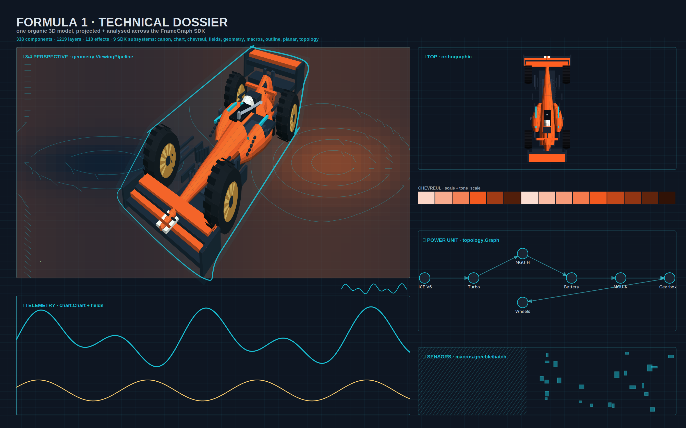

---
disclaimer:
  notice: >-
    No information within this document should be taken for granted.
    Any statement or premise not backed by a real logical definition
    or verifiable reference may be invalid, erroneous, or a hallucination.
  generated_by: "Claude (Anthropic) via Claude Code"
  date: "2026-07-06"
---

# F1 build study — three.js (WebGL) vs FrameForge SDK

Two independent renderings of the *same brief* — a Formula 1 car with a
`components / layers / effects` HUD hitting the same thresholds (>256 / >1024 /
>75) — one built on **three.js** (real-time WebGL), one built on the
**FrameForge SDK** (a deterministic vector document). This note compares the two
paradigms from the actual artifacts, not from memory.

Sources compared:

- `f1laminar.html` — "APX-26 LAMINAR", three.js **r128** WebGL, loaded via a
  CDN `<script>` (grounding note below).
- `static/examples/f1_spec_sheet.py` + `static/examples/f1_car_3d.py` — the
  FrameForge model + dossier authored in this repo.

> **"3D.js" = three.js.** The uploaded file itself loads
> `three.js/r128/three.min.js`; the comparison below reads "3D.js" as three.js.

---

## The renders

**three.js — `f1laminar.html`** (HUD: 288 components · 1,124 layers · 80 effects)

**FrameForge SDK — technical dossier** (338 components · 1,219 layers · 110 effects · 9 SDK subsystems)

Both HUDs report near-identical counts because both were built to the same
target — this is a clean A/B of *rendering paradigm*, holding subject and spec
constant.

---

## Grounding note (a real data point, not a side issue)

`f1laminar.html` pulls three.js from `cdnjs` at runtime. In an offline / network-
restricted browser the script fails with `ERR_CONNECTION_RESET`, the scene never
initialises, and the HUD stays on `—`. It only rendered here after the library
was **vendored locally**. The FrameForge piece has no runtime dependency: it is
authored in Python, validated against a schema, and rasterised headless. That
difference — *needs a live engine + network* vs *self-contained document* — is
the comparison in miniature.

---

## Head to head

| Dimension | three.js (`f1laminar`) | FrameForge SDK (this repo) |
|---|---|---|
| Rendering model | GPU rasteriser, true **z-buffer** | CPU **painter's algorithm** (depth sort only) |
| Shading | **PBR** — metalness/roughness, IBL reflections (PMREM), 4-light rig, soft shadows, ACES tonemap, fog | **Flat Lambert** per face; shadow/glow *faked* as SVG filters |
| Occlusion | Correct (per-pixel depth) | **Approximate** — large/intersecting faces can mis-sort |
| Interactivity | Orbit, zoom, auto-orbit, DRS + wheel animation, live telemetry, FPS | **None** — a still document |
| Output | Ephemeral browser pixels | Deterministic **SVG / PNG / PDF**, headless, no GPU |
| Reproducibility | Varies by frame / time / device | **Byte-stable**, schema-validated, round-trips through the MCP (`ok:true`) |
| Dependencies | three.js runtime + WebGL + network | Self-contained; renders headless |
| Where the hard 3D lives | A mature ~600 KB engine (PBR, shadows, IBL) | Hand-rolled projection/cull/shading; the SDK's own `geometry.Camera` / `ViewingPipeline` does the projection |

---

## Convergent construction (the most interesting finding)

Given the same brief, both implementations **independently landed on the same
model recipe**:

- a body **lofted from elliptical cross-section slices** — three.js instances a
  `CylinderGeometry` slice along X ("laminated construction"); FrameForge sweeps
  `ellring` stations through `loft()`. Same idea, two engines.
- **cylinder wheels** with spokes / hub / tread;
- the **identical `components / layers / effects` HUD** to the same thresholds.

The divergence is entirely in the *rendering paradigm*, not the geometry.

---

## "Effects: 80" vs "110" are not the same unit

three.js's effects are **GPU shading passes** — IBL reflections, bloom, ACES
tonemap, soft shadows — each visually load-bearing. FrameForge's effect entries
are **SVG filter primitives** (glow / drop-shadow), many of them subtle or
cosmetic. A larger count does **not** mean more visual impact; three.js's are
heavier per unit. Stated plainly so the numbers are not read as a scoreboard.

---

## Honest read of the two artifacts

- **three.js looks more premium** — metallic reflections, a low dusk sun, soft
  shadows, cinematic grade. But its *model reads rougher*: pronounced laminate
  ribbing, some floating aero elements, and low-key lighting that muddies the
  form. And it did not render offline without vendoring the library.
- **FrameForge is flatter / diagram-like**, but the car is more *legibly* an F1
  (the orthographic plan especially), and it is fully **deterministic and
  machine-verifiable** — the entire point of that stack.

---

## Verdict — different layers, not competitors

- Want an **interactive, photoreal-ish hero / configurator / web toy** →
  three.js wins decisively; GPU PBR + orbit is exactly its job.
- Want a **deterministic, verifiable, embeddable spec / diagram / print asset**
  that renders headless with no GPU and round-trips through a schema →
  FrameForge wins.

three.js is a real-time 3D **engine**; FrameForge is a document/graphics **DSL**
with a modest built-in 3D pipeline for illustration. They occupy different
layers of the stack; the right choice is set by whether the deliverable is a
*live experience* or a *verifiable artifact*.

### If the goal were to close the "premium" gap in FrameForge

Staying fully deterministic, the achievable moves are: a fake-reflection tone
ramp per face (`chevreul.tone_scale` keyed on the face normal), a real
ground-plane cast shadow (`planar` projection of the silhouette), and a rim-
light pass in the shading term. None reach PBR, but they narrow the distance
without adding a runtime.
